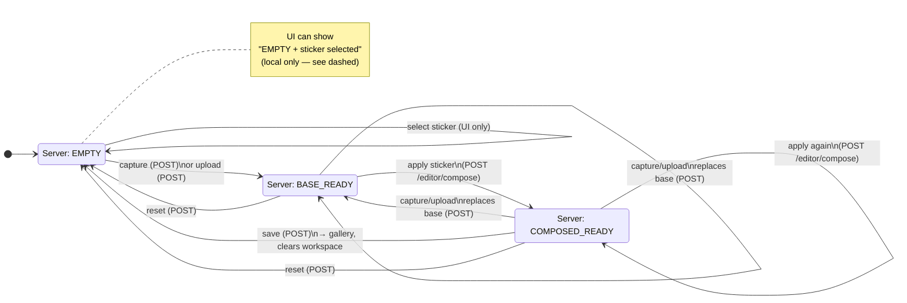
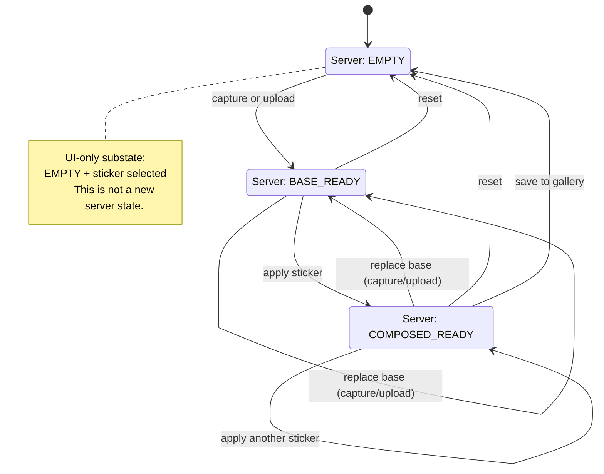

# Editor state — visual overview

This page complements the code map in `docs/editor_code_map.md`. It separates **what the server considers true** from **what the browser can layer on top** for the same page.

## Three server states vs four UI situations

| Layer | Count | Names |
|--------|--------|--------|
| **Server (canonical)** | **3** | `EMPTY`, `BASE_READY`, `COMPOSED_READY` |
| **Browser UI (what the user experiences)** | **4** | `EMPTY`, **EMPTY with sticker selected**, `BASE_READY`, `COMPOSED_READY` |

The extra UI situation is **EMPTY with sticker selected**: the server is still in **`EMPTY`** (no valid workspace temp file in session + on disk). The user has chosen a sticker **before** capture or upload. That choice lives in **hidden form fields and JavaScript** until a POST carries it to the server; it is **not** a fourth value of `editorState` in PHP.

After a successful **capture** or **upload**, the server may store a validated pending sticker in session (`editor_pending_sticker`); that affects the next **GET** `/editor`, but the canonical workflow state for “no base image yet” remains **`EMPTY`** until a temp file exists.

## Mermaid diagram

The diagram below uses **solid arrows** for transitions that hit the server (POST + redirect or full-page render). The **dashed arrow** is **UI-only** (no `editorState` change on the server until capture/upload).

### Legend

| Transition | Server-side? | Notes |
|------------|----------------|-------|
| **select sticker** (in `EMPTY`) | **No** | Updates `#editor-capture-sticker` / `#editor-upload-sticker` and guidance text in JS; `editorState` stays `EMPTY`. |
| **capture** / **upload** | **Yes** | `EditorController::capture()` / `upload()` create or replace `$_SESSION['editor_temp_image']`, set `BASE_READY`, redirect to `GET /editor`. |
| **apply / compose** | **Yes** | `EditorController::compose()` runs `ImageComposeService`, may set `COMPOSED_READY`, clears compose authorization until success. |
| **save** | **Yes** | `EditorController::save()` only when normalized state is `COMPOSED_READY` and compose authorization matches temp basename. |
| **reset** | **Yes** | `EditorController::reset()` clears temp path, session flags, deletes tmp file, sets `EMPTY`. |

For precise file and function references, see `docs/editor_code_map.md`.
